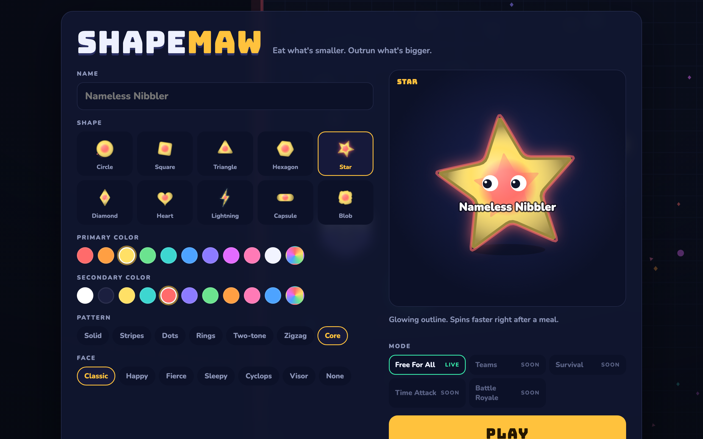
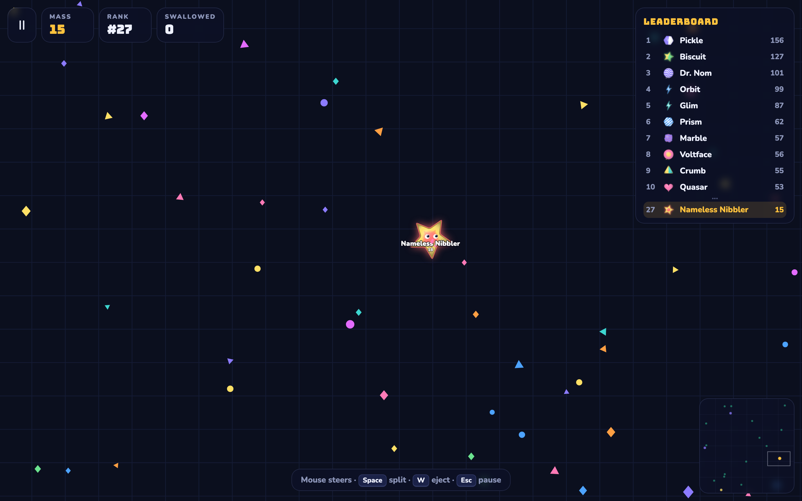

# Shapemaw Arena

A single-file HTML5 canvas game: eat food, shatter mines, and swallow other shapes to climb the leaderboard. Choose from 10 shapes, customize your colors and pattern, and out-grow a field of AI opponents with distinct personalities.

**[Play it live](https://shapemaw.vercel.app)**

## Screenshots





## Controls

| Action       | Input            |
| ------------ | ---------------- |
| Steer        | Mouse            |
| Split        | `Space`          |
| Eject mass   | `W`              |
| Pause        | `Esc`            |

Green thornmines shatter anything big enough to swallow them — use them as cover or bait.

## Features

- **10 shapes** — Circle, Square, Triangle, Hexagon, Star, Diamond, Heart, Lightning, Capsule, and Blob, each with its own hitbox and visual style.
- **Deep customization** — primary/secondary color, patterns (solid, stripes, dots, rings, two-tone, zigzag, core), and eye styles.
- **AI opponents** — 26 bots with five personalities (aggressive, passive, opportunistic, avoidant, random).
- **HUD** — mass, rank, kills, leaderboard, and minimap.
- **Settings** — master/music/SFX volume, screen shake, and touch controls.

## Tech

- One `index.html` file — no build step, no dependencies, no framework.
- Renders to a 2D `<canvas>`; all game logic, audio (Web Audio API), and rendering are inlined.

## Run locally

Just open `index.html` in a browser, or serve the directory:

```sh
npx serve .
```

## Deploy

Deployed on [Vercel](https://vercel.com). Push to `main` to redeploy automatically.
